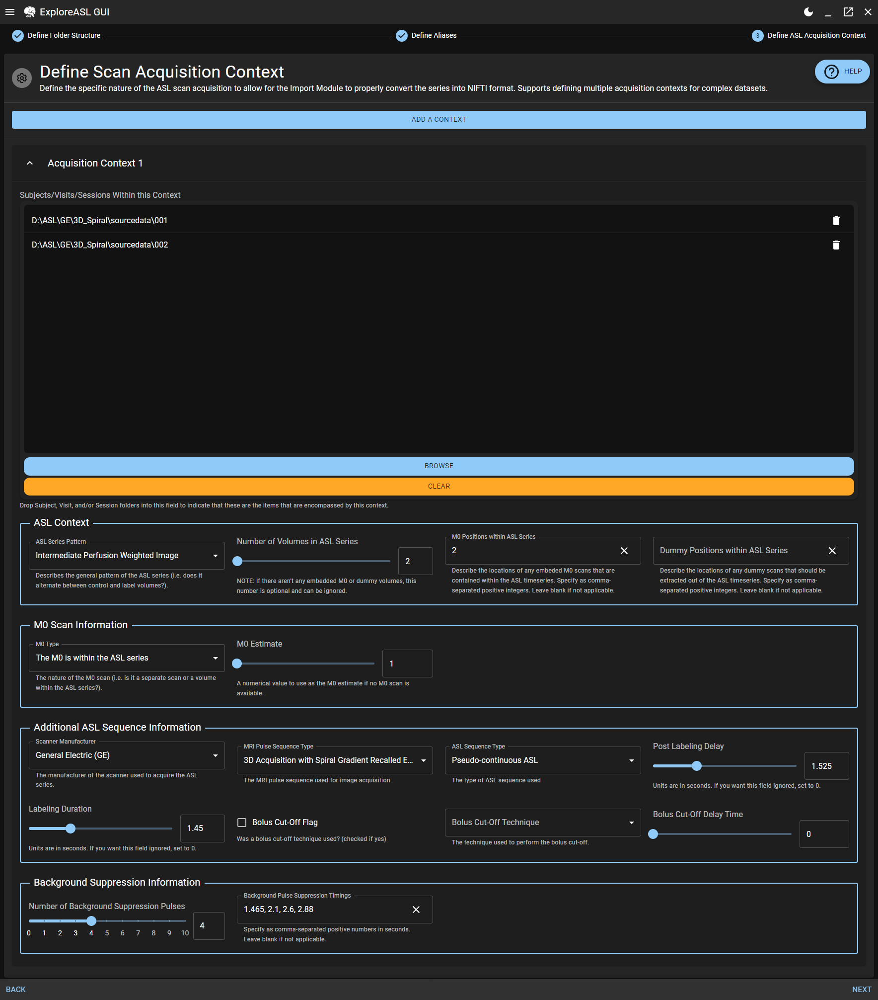
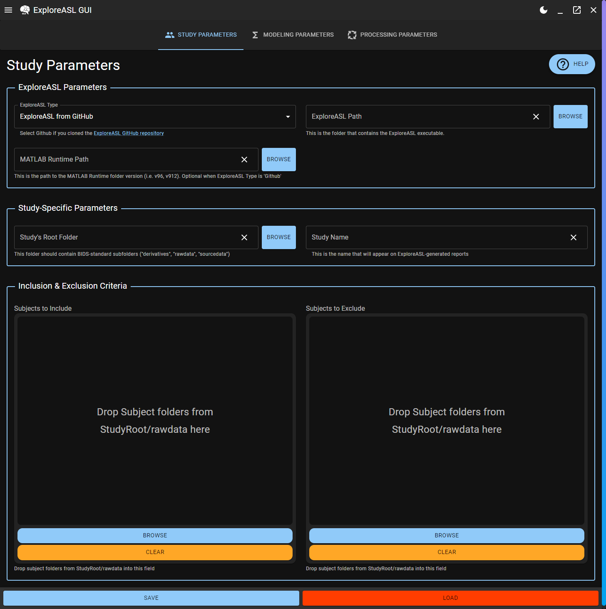

[![Contributors][contributors-shield]][contributors-url]
[![Forks][forks-shield]][forks-url]
[![Stargazers][stars-shield]][stars-url]
[![Issues][issues-shield]][issues-url]
[![MIT License][license-shield]][license-url]
[![LinkedIn][linkedin-shield]][linkedin-url]

<!-- PROJECT LOGO -->
 

  

  <h3 align="center">ExploreASL GUI</h3>

  

    Scanner To Publication User Interface for ASL Imaging
     
     
    <a href="https://github.com/MauricePasternak/ExploreASL-GUI/issues/new?assignees=MauricePasternak&labels=bug&template=bug_report.md&title=">Report Bug</a>
    ·
    <a href="https://github.com/MauricePasternak/ExploreASL-GUI/issues/new?assignees=MauricePasternak&labels=enhancement&template=feature_request.md&title=">Request Feature</a>
    ·
    <a href="https://github.com/MauricePasternak/ExploreASL-GUI/releases">Download</a>
    ·
    <a href="https://mauricepasternak.github.io/ExploreASL-GUI-Docs/latest">Documentation</a>
  

<!-- TABLE OF CONTENTS -->

  
Table of Contents

  <ol>
    <li>
      <a href="#about-the-project">About The Project</a>
      <ul>
        <li><a href="#built-with">Built With</a></li>
      </ul>
    </li>
    <li>
      <a href="#download">Download</a>
    </li>
    <li>
      <a href="#documentation">Documentation</a>
    </li>
    <li>
      <a href="#workflow">Workflow</a>
      <ul>
        <li><a href="#1-import-your-dataset">1) Import Your Dataset</a></li>
        <li><a href="#2-verify-bids">2) Verify BIDS</a></li>
        <li><a href="#3-define-processing-parameters">3) Define Processing Parameters</a></li>
        <li><a href="#4-run-exploreasl">4) Run ExploreASL</a></li>
        <li><a href="#5-visualize-your-results">5) Visualize Your Results</a></li>
      </ul>
    </li>
    <li><a href="#roadmap">Roadmap</a></li>
    <li><a href="#contributing">Contributing</a></li>
    <li><a href="#license">License</a></li>
    <li><a href="#contact">Contact</a></li>
    <li>
        <a href="#acknowledgments">Acknowledgments</a>
        <ul>
            <li><a href="#support">Support</a></li>
            <li><a href="#exploreasl-team">ExploreASL Team</a></li>
        </ul>
    </li>
  </ol>

---

## <!-- ABOUT THE PROJECT -->

## About The Project

This project wraps around [ExploreASL](https://exploreasl.github.io/Documentation/1.10.0beta/) to provide users with a friendly and modern interface for analyzing their arterial spin labeling datasets, including:

- Importing their ASL datasets into [Brain Imaging Data Standard](https://bids.neuroimaging.io/) (BIDS) format
- Defining and re-using data parameters across studies for easier troubleshooting
- Adjusting BIDS-specific fields at the level of individual scans to cater to the specific needs of each dataset
- Running ExploreASL's modules in a parallel manner using multiprocessing to split the workload within and between studies
- Visualize and interact with the processed dataset using graphs that allow for loading in specific cerebral perfusion volumes when users click on datapoints

### Built With

[![Electron][electronjs]][electron-url]
[![React][react.js]][react-url]
[![MaterialUI][mui.js]][mui-url]

(<a href="#top">back to top</a>)

---
<!-- RELEASES -->

## Download

The latest downloadable releases for your operating system can be found [here](https://github.com/MauricePasternak/ExploreASL-GUI/releases).

(<a href="#top">back to top</a>)

---

<!-- DOCUMENTATION -->

## Documentation

Complete documentation for this project is hosted on [GitHub Pages](https://mauricepasternak.github.io/ExploreASL-GUI-Docs/latest/). While it is recommended to give it a general read-through before using the application, most of the inputs within the application are accompanied by helper captions that provide additional information when completing a specific step.

**Installation instructions** are [also found within the documentation](https://mauricepasternak.github.io/ExploreASL-GUI-Docs/0.4/Installation/Users/).

(<a href="#top">back to top</a>)

---

<!-- USAGE EXAMPLES -->

## Workflow

### 1) Import Your Dataset

To start off with, you'll have to convert the output from your DICOM scanner(s) into proper [Brain Imaging Data Structure (BIDS)](https://bids-specification.readthedocs.io/en/stable/) format.

This is accomplished via a 4-step procedure:

1. Define the pieces of information found in the folder names leading to the DICOM files (i.e. does a folder name contain the subject ID, the session ID, etc.)
2. Define which folders account for which type of scan (i.e. ASL, T1w, T2w, etc.) and whether you'd like to have any visits/sessions renamed.
3. Define how the various scans present with the dataset were acquired (see image below). This includes parameters like Post Labeling Delay, Background Suppression, etc.
4. Run ExploreASL's Import Module.

  

(<a href="#top">back to top</a>)

### 2) Verify BIDS

Once a study has been imported to BIDS format, you can verify appropriate parameters are present for processing ASL by loading all BIDS sidecars into an interactive datagrid with **built-in BIDS Validation** (see below).

The datagrid allows for easy editing of BIDS fields with immediate feedback on whether the changes are valid or not. This is especially useful when dealing with anonymized datasets that lack certain fields.

  

(<a href="#top">back to top</a>)

### 3) Define Processing Parameters

There are a plethora of parameters tied to defining how an ASL-BIDS dataset should be processed. ExploreASL-GUI helps you define these parameters in a repeatable and reviewable manner.

Parameters are divided into 3 subsections:

1. **Study parameters** (where is the study, what is its name, which subjects should be processed specifically, etc.)
2. **Modeling parameters** (will a single or dual compartment model be used, what is the assumed T2* of the blood, etc.)
3. **ExploreASL pipeline parameters** (which atlases to use when quantifying CBF ROIs, what should be the T-value for motion control, etc.)

Configurations can be easily saved **with validation** and re-loaded when tweaking settings.

  

(<a href="#top">back to top</a>)

### 4) Run ExploreASL

ExploreASL-GUI allows for multiprocessing of several studies and/or several subjects per study in parallel, making the most of your computer's resources.

Percent completion, text feedback, and visual QC images of processed structural and functional images are provided while the pipeline is running (see below).

  

(<a href="#top">back to top</a>)

### 5) Visualize Your Results

ExploreASL-GUI allows for streamlined QC analysis and overall visualization of the processed datasets. Users are given the ability to merge their own demographics/clinical/neuropsyche ancillary data with the CBF data generated by ExploreASL and represented as interactive graphs of 2 flavors:

- scatterplot (for continuous x continuous data; example below)
- swarmplot (for categorical x continuous data)

Emphasis on **interactive**. Clicking on datapoints will allow for the corresponding CBF volume to the loaded in for visual inspection across all dimensions and slices.

Plots with accompanying CBF volumes can be saved as PNGs for you publication purposes.

  

(<a href="#top">back to top</a>)

---

## <!-- ROADMAP -->

## Roadmap

- [x] Add Dark Mode.
- [x] Add Image Feedback during processing.
- [x] Support multiple ASL Import contexts.
- [x] Create a Data Visualization Module.
- [x] Add plot settings for plot legends (i.e. legend text fontsize, positioning, etc.) within the DataVisualization Module.
- [x] Add more helpful information in the Process Studies module for when a study does not fully complete.
- [x] Add help information on the steps within the Data Visualization Module.
- [x] Add plot settings for renaming axis main labels within the Data Visualization Module.
- [x] Add a separate module where users can pin-point change the JSON sidecars of individual subjects/visits/sessions.
- [x] Allow for plots to be exported as PNG files in the Data Visualization Module.
- [ ] Migrate to Tauri for a more stable backend and better application performance, especially on Windows.
- [ ] Allow for the Data Visualization module to save/load a JSON parameters to allow for quick re-plotting.
- [ ] Add auto-update capability to the software so that users don't have to manually install new versions.

See the [open issues](https://github.com/othneildrew/Best-README-Template/issues) for a full list of proposed features (and known issues).

(<a href="#top">back to top</a>)

---

## <!-- CONTRIBUTING -->

## Contributing

Contributions are what make the open source community such an amazing place to learn, inspire, and create. Any contributions you make are **greatly appreciated**.

If you have a suggestion that would make this better, please fork the repo and create a pull request. You can also simply open an issue with the tag "enhancement".
Don't forget to give the project a star! Thanks again!

1. Fork the Project
2. Create your Feature Branch (`git checkout -b feature/AmazingFeature`)
3. Commit your Changes (`git commit -m 'Add some AmazingFeature'`)
4. Push to the Branch (`git push origin feature/AmazingFeature`)
5. Open a Pull Request

(<a href="#top">back to top</a>)

---

## <!-- LICENSE -->

## License

Distributed under the MIT License. [See `LICENSE` for more information](https://raw.githubusercontent.com/MauricePasternak/ExploreASL-GUI/main/LICENSE).

(<a href="#top">back to top</a>)

---

## <!-- CONTACT -->

## Contact

Maurice Pasternak - maurice.pasternak@utoronto.ca

Project Link: [https://github.com/MauricePasternak/ExploreASL-GUI](https://github.com/MauricePasternak/ExploreASL-GUI)

(<a href="#top">back to top</a>)

---

## <!-- ACKNOWLEDGMENTS -->

## Acknowledgments

### Support

For GUI-related questions, please don't hesitate to drop an email at: maurice.pasternak@utoronto.ca

For more information on the main program, click on the following: [CLICK ME!](https://sites.google.com/view/exploreasl)

### ExploreASL Team

For questions or concerns with the underlying ExploreASL program, the following individuals compromise the development team and may be contacted:

- Henk-Jan Mutsaerts; HenkJanMutsaerts@Gmail.com (ExploreASL creator)
- Jan Petr; j.petr@hzdr.de (ExploreASL creator)
- Michael Stritt; stritt.michael@gmail.com
- Paul Groot; p.f.c.groot@amsterdamumc.nl
- Pieter Vandemaele; pieter.vandemaele@gmail.com
- Maurice Pasternak; maurice.pasternak@utoronto.ca
- Luigi Lorenzini; l.lorenzini@amsterdamumc.nl
- Sandeep Ganji; Sandeep.g.bio@gmail.com

(<a href="#top">back to top</a>)

---

<!-- MARKDOWN LINKS & IMAGES -->
<!-- https://www.markdownguide.org/basic-syntax/#reference-style-links -->

[contributors-shield]: https://img.shields.io/github/contributors/MauricePasternak/ExploreASL-GUI.svg?style=for-the-badge
[contributors-url]: https://github.com/MauricePasternak/ExploreASL-GUI/graphs/contributors
[forks-shield]: https://img.shields.io/github/forks/MauricePasternak/ExploreASL-GUI.svg?style=for-the-badge
[forks-url]: https://github.com/MauricePasternak/ExploreASL-GUI/network/members
[stars-shield]: https://img.shields.io/github/stars/MauricePasternak/ExploreASL-GUI.svg?style=for-the-badge
[stars-url]: https://github.com/MauricePasternak/ExploreASL-GUI/stargazers
[issues-shield]: https://img.shields.io/github/issues/MauricePasternak/ExploreASL-GUI.svg?style=for-the-badge
[issues-url]: https://github.com/MauricePasternak/ExploreASL-GUI/issues
[license-shield]: https://img.shields.io/github/license/MauricePasternak/ExploreASL-GUI.svg?style=for-the-badge
[license-url]: https://github.com/MauricePasternak/ExploreASL-GUI/blob/master/LICENSE.txt
[linkedin-shield]: https://img.shields.io/badge/-LinkedIn-black.svg?style=for-the-badge&logo=linkedin&colorB=555
[linkedin-url]: https://www.linkedin.com/in/maurice-pasternak-238957207/

<!-- Badges -->

[react.js]: https://img.shields.io/badge/React-20232A?style=for-the-badge&logo=react&logoColor=61DAFB
[react-url]: https://reactjs.org/
[electron-url]: https://www.electronjs.org
[electronjs]: https://img.shields.io/badge/Electron-2b2e3a?style=for-the-badge&logo=electron&logoColor=white
[mui.js]: https://img.shields.io/badge/Material%20UI%20V5-0074e9?style=for-the-badge&logo=mui&logoColor=white
[mui-url]: https://mui.com/
