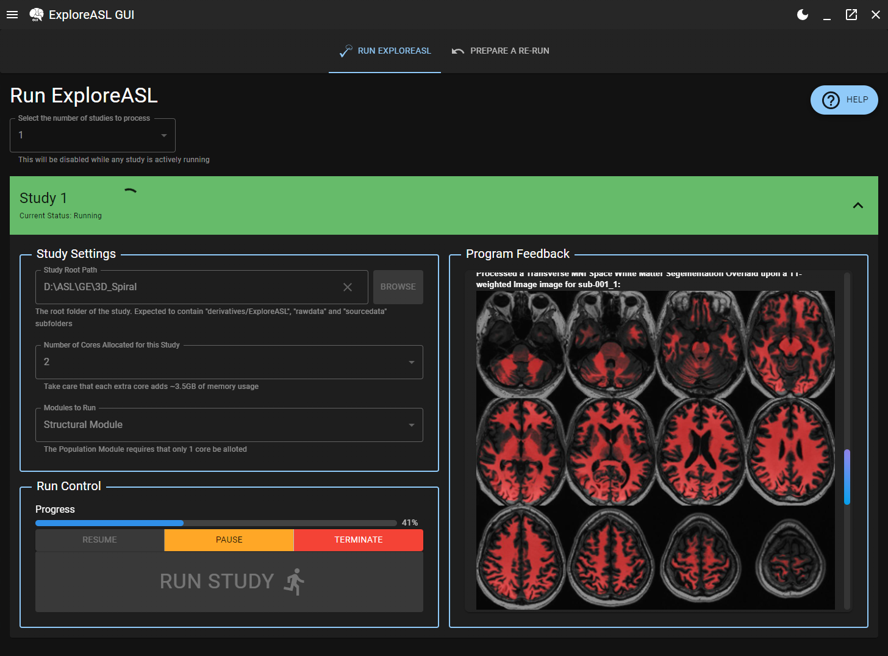
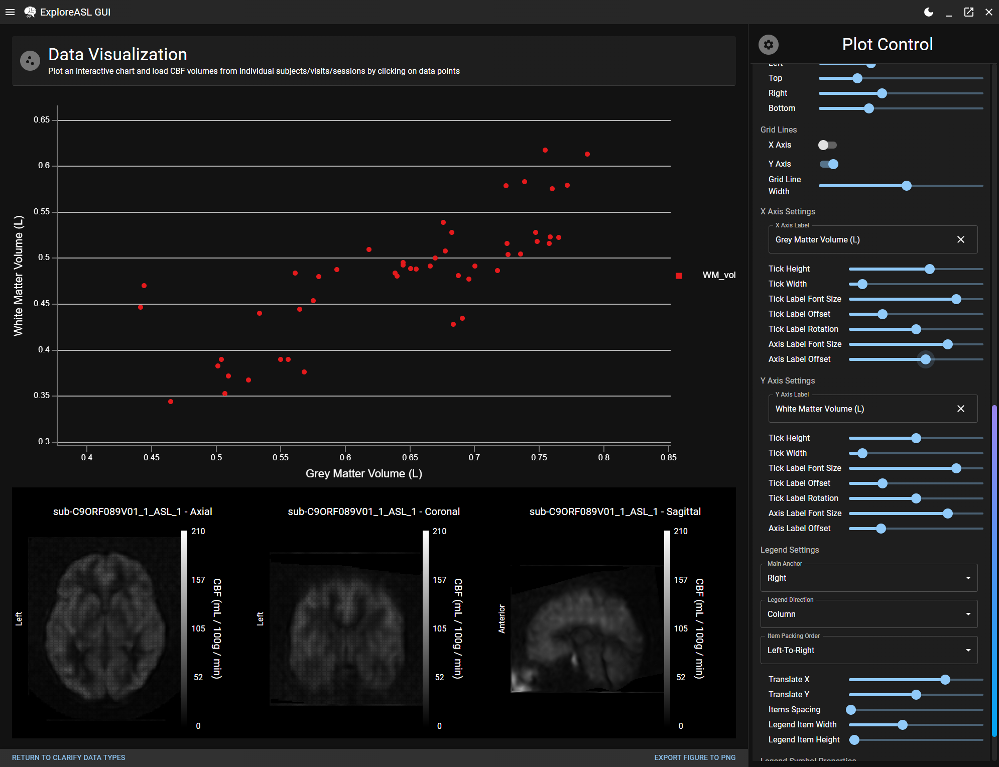

<div id="top"></div>

[![Contributors][contributors-shield]][contributors-url]
[![Forks][forks-shield]][forks-url]
[![Stargazers][stars-shield]][stars-url]
[![Issues][issues-shield]][issues-url]
[![MIT License][license-shield]][license-url]
[![LinkedIn][linkedin-shield]][linkedin-url]
[](https://www.buymeacoffee.com/mauricepasq)

<!-- PROJECT LOGO -->
<br />
<div align="center">
  <a href="https://github.com/othneildrew/Best-README-Template">
    
  </a>

  <h3 align="center">ExploreASL GUI</h3>

  <p align="center">
    Scanner To Publication User Interface for ASL Imaging
    <br />
    <br />
    <a href="https://github.com/MauricePasternak/ExploreASL-GUI/issues/new?assignees=MauricePasternak&labels=bug&template=bug_report.md&title=">Report Bug</a>
    ·
    <a href="https://github.com/MauricePasternak/ExploreASL-GUI/issues/new?assignees=MauricePasternak&labels=enhancement&template=feature_request.md&title=">Request Feature</a>
    .
    <a href="https://mauricepasternak.github.io/ExploreASL-GUI-Docs/latest">Documentation</a>
  </p>
</div>

<!-- TABLE OF CONTENTS -->
<details open>
  <summary>Table of Contents</summary>
  <ol>
    <li>
      <a href="#about-the-project">About The Project</a>
      <ul>
        <li><a href="#built-with">Built With</a></li>
      </ul>
    </li>
    <li>
      <a href="#documentation">Documentation</a>
    </li>
    <li>
      <a href="#getting-started">Getting Started</a>
      <ul>
        <li><a href="#installation-instructions-for-developers">Installation for Developers</a></li>
        <li><a href="#general-project-structure">General Structure</a></li>
        <li><a href="#installation-instructions-for-users">Installation for Users</a></li>
        <li><a href="#uninstallation-instructions-for-users">Uninstallation for Users</a></li>
      </ul>
    </li>
    <li><a href="#usage">Usage</a></li>
    <li><a href="#roadmap">Roadmap</a></li>
    <li><a href="#license">License</a></li>
    <li><a href="#contact">Contact</a></li>
    <li>
        <a href="#acknowledgments">Acknowledgments</a>
        <ul>
            <li><a href="#support">Support</a></li>
            <li><a href="#exploreasl-team">ExploreASL Team</a></li>
        </ul>
    </li>
  </ol>
</details>

---

## <!-- ABOUT THE PROJECT -->

## About The Project

This project wraps around [ExploreASL](https://exploreasl.github.io/Documentation/1.10.0beta/) to provide users with a friendly and modern interface for analyzing their arterial spin labeling datasets, including:

- Importing their ASL datasets into [Brain Imaging Data Standard](https://bids.neuroimaging.io/) (BIDS) format
- Defining and re-using data parameters across studies for easier troubleshooting
- Adjusting BIDS-specific fields at the level of individual scans to cater to the specific needs of each dataset
- Running ExploreASL's modules in a parallel manner using multiprocessing to split the workload within and between studies
- Visualize and interact with the processed dataset using graphs that allow for loading in specific cerebral perfusion volumes when users click on datapoints

<p align="right">(<a href="#top">back to top</a>)</p>

### Built With

[![Electron][electronjs]][electron-url]

[![React][react.js]][react-url]

[![MaterialUI][mui.js]][mui-url]

<p align="right">(<a href="#top">back to top</a>)</p>


---

<!-- DOCUMENTATION -->

## Documentation

The documentation for this project is hosted on [GitHub Pages](https://mauricepasternak.github.io/ExploreASL-GUI-Docs/latest/). While this README serves as a quickstart guide, the documentation provides a more detailed overview of the project's features and how to use them.


<p align="right">(<a href="#top">back to top</a>)</p>

---

<!-- GETTING STARTED -->

## Getting Started

### Installation Instructions For Users

#### 1) Get the pre-requisites

Depending on the type of ExploreASL installation you have, you will need either:

- A [standard MATLAB installation that preferrably at least R2019a](https://login.mathworks.com/embedded-login/landing.html?cid=getmatlab&s_tid=gn_getml)
  and [ExploreASL](https://github.com/ExploreASL/ExploreASL) from GitHub. This is currently the more stable option.

OR

- [MATLAB Runtime R2019a (9.6)](https://www.mathworks.com/products/compiler/matlab-runtime.html) and a pre-compiled version of ExploreASL (currently not publically available; please contact the [developers of ExploreASL](https://sites.google.com/view/exploreasl/contact) for more information)

#### 2) Download the latest release of this project and install it on your local machine

Head on over to the [Releases](https://github.com/MauricePasternak/ExploreASL-GUI/releases) and download the appropriate version for your operating system

### Uninstallation/Removal Instructions For Users

#### For Windows

In your search bar, look for "Add or remove programs". Select the application and click uninstall.

#### For Linux

Open a terminal and type in:

```bash
sudo apt remove ExploreASL-GUI
```

#### For MacOS

Go to the Applications folder and drag & drop the ExploreASL-GUI.app application to the Trash bin.

##

### Installation Instructions For Developers

#### 1) Ensure that you have NodeJS and NPM installed on your machine

[Click here](https://nodejs.org/en/) for more information on NodeJS installation.

#### 2) Ensure that you have the `yarn` package manager installed on your machine

Simply install it via the command line:

```sh
npm install --global yarn
```

#### 3) Clone the repo and install the dependencies

- Clone the repo using:
  ```sh
  git clone https://github.com/MauricePasternak/ExploreASL-GUI.git
  ```
- Install Javascript packages contained within `package.json`
  ```sh
  yarn install
  ```
- Start up the GUI with hot-reload and have a crack at it
  ```sh
  yarn start
  ```
- If you'd like to package the application for your operating system:
  ```sh
  yarn make
  ```

### General Project Structure

```
/---|
    |-> assets (media such as icons)
    |-> backend (logic executed by electron's IpcMain, i.e. spawning subprocesses to run ExploreASL)
    |-> common -|
    |           |-> schemas (form validators & form schemas)
    |           |-> types (reusable types & typescript declarations)
    |           |-> utilityFunctions (reusable functions for reducing code use)
    |           |-> GLOBALS.ts (global variables used throughout)
    |
    |-> ipc (logic for type-safe IpcMain <-> IpcRenderer communication)
    |-> components (reuseable React components)
    |-> pages (non-reuseable React components that make up the pages of the GUI)
    |-> stores (frontend-only collections of user-interface state)
    ... other files relate to project setup, package-handling, etc.
```

<p align="right">(<a href="#top">back to top</a>)</p>

---

<!-- USAGE EXAMPLES -->

## Usage

### 1) Import Your Dataset

To start with, you'll have to convert the output from your DICOM scanner(s) into proper <a href="https://bids-specification.readthedocs.io/en/stable/"> Brain Imaging Data Structure (BIDS)</a> format.

This is accomplished via a 3-step procedure:

1. You'll have to define the information contained at each folder level (i.e. do folder names correspond to subjects, scans, etc?). The page this corresponds to is demonstrated in the image below.
2. For visits and sessions, you'll have the option to specify the alias name output. For scans, you'll have to specify which scan folders pertain to which imaging modality.
3. You'll specify the nature/context of the ASL acquistion(s) (i.e. how many volumes are contained in a series, are they an alternating control-label set, etc.). You should specify a separate context for every different vendor/sequence used.

You'll then be brought to the run page where you can get text feedback as to the import progress occurring. For long-running imports, you'll have the option to pause/resume/terminate the import process as well.


### 2) Define Processing Parameters

As a second step, you'll have to define the overall (global) settings that should be taken into account when processing a dataset. In general these fall under 3 subcategories:

1. The study parameters (where is the study, what is its name, which subjects should be processed specifically, etc.)
2. The ASL sequence parameters. While this is somewhat redundant from what the Import section did earlier, it is important to understand that a lot datasets contain anonymized data. Anonymization sometimes removes crucial fields needed for CBF quantification. Therefore, by defining values to fallback on, you would allow ExploreASL to continue with the analysis.
3. The ExploreASL pipeline parameters (which atlases to use when quantifying CBF ROIs, motion control, etc.)

When done, your values will be saved as a data parameters file (DataPar.json) at the root of your dataset. This is the central file that ExploreASL uses to analyze your dataset. If you'd like to change a particular parameter at a later time, you can always re-load any existing DataPar.json file, change what values you wish, and save it again.

❗ If your dataset is complex and specific scans need to have their fields tweaked, the next module tackles the issue.


### 3) Tweak BIDS Fields (Optional)

Occasionally, it may be necessary to tweak very specific ASL-processing fields of certain scans that the global settings from the previous step do not encompass. This optional module allows users to tweak the <a href="https://bids-specification.readthedocs.io/en/stable/">BIDS-related ASL fields</a> for any imported dataset.

⚠️ **It is assumed that users are familiar with BIDS if they intend to use this part of the program. In particular, they are expected to understand which fields are exclusionary with others.**

Users will have to specify the root folder of the study they'd like to tweak. If valid, a spreadsheet will auto-populate with the BIDS fields. The following types of fields are supported:

- Text-based fields
- Numerical fields
- Boolean (yes/no, true/false, etc.) fields
- Option-based fields

The appropriate widget will be present within each cell to allow users to set an appropriate value for that field.

Due to the nature of datasets varying wildly between BIDS fields that are present (i.e. one set of scans is a PASL ASL sequence that needs a "PASL Type" field, another set is a PCASL sequence that needs a "PCASL Type" field), the following additional features allow users to specify their datasets accordingly.:

- New BIDS columns can be added to the spreadsheet
- Most columns can be removed from the spreadsheet if the field is not applicable to any scan.
- Users can select a cell and make it "blank" by pressing Delete after having selected the cell. This has the effect of treating the BIDS field as if it doesn't exist for that particular scan. **If you have a complex dataset containing exclusionary fields across different scan subsets, this is the best way to avoid conflicts.**


### 4) Run ExploreASL

With the dataset imported, global settings define, and any scan-specific tweaks implemented, the study can be analyzed by ExploreASL. Some neat features you should be aware of:

- You can make the most of your workstation by alloting additional computer cores that will process studies & subjects within those studies in parallel.
- As with the Import module, you'll be given the option to pause/resume/terminate studies being run independently. Forceful temrination will always result in an error, as the program gives feedback for steps that were or were not completed.
- As steps complete, you'll also be given visual feedback for your quality control procedures.

In a separate tab, you'll have the option to indicate any particular modules/subjects/exact steps that you'd like to re-run for a given study.

Run the ExploreASL modules as per your needs and proceed to the next step for any study which has successfully completed the Population module.



### 5) Visualize Your Dataset (Optional)

Optionally, you visualize your completed studies. As with the Import Module, there are first some preparatory steps to complete:

1. You'll have to specify which study should be visualized, the atlases containing your ROIs, and optionally, specifying your own metadata spread sheet to merge the ExploreASL data with.
2. The result of the previous step will form a single spreadsheet in-memory and you'll have to clarify the type of variable that each column contains. Namely, Categorical or Continuous. This assists the program in ascertaining which variables to suggest for each axis when plotting.

You'll now have access to the main plotting page (example image below). There are two main plot types supported:

- Scatterplot, for Continuous by Continuous comparisons
- Swarmplot, for Categorical by Continuous comparisons

Regardless, the point-like nature of these plots will allow you to click on datapoints and load the CBF image corresponding to that particular point. Perform QC analysis as required.

Additional features to keep in mind:

- Both Scatterplot and Swarmplot allow for significant customization of plot visuals, if you're looking to get a graph out for a figure. Unfortunately, at the current time there is no image export feature available, so you'll have to settle for a screenshot.
- By default, only axes values are added to the data hover tooltip. However, you can specify additional variables to include if you're using this program for an interactive presentation.
- You can hover over a particular pixel in the CBF image to get its CBF value.
- For large datasets, you can subset the data to single-datapoint precision using a combination of subsetting filters.



<p align="right">(<a href="#top">back to top</a>)</p>

---

## <!-- ROADMAP -->

## Roadmap

- [x] Add Dark Mode.
- [x] Add Image Feedback during processing.
- [x] Support multiple ASL Import contexts.
- [x] Create a Data Visualization Module.
- [x] Add plot settings for plot legends (i.e. legend text fontsize, positioning, etc.) within the DataVisualization Module.
- [x] Add more helpful information in the Process Studies module for when a study does not fully complete.
- [x] Add help information on the steps within the Data Visualization Module.
- [x] Add plot settings for renaming axis main labels within the Data Visualization Module.
- [x] Add a separate module where users can pin-point change the JSON sidecars of individual subjects/visits/sessions.
- [x] Allow for plots to be exported as PNG files in the Data Visualization Module.
- [ ] Allow for the Data Visualization module to save/load a JSON parameters to allow for quick re-plotting.
- [ ] Add auto-update capability to the software so that users don't have to manually install new versions.

See the [open issues](https://github.com/othneildrew/Best-README-Template/issues) for a full list of proposed features (and known issues).

<p align="right">(<a href="#top">back to top</a>)</p>

---

## <!-- CONTRIBUTING -->

## Contributing

Contributions are what make the open source community such an amazing place to learn, inspire, and create. Any contributions you make are **greatly appreciated**.

If you have a suggestion that would make this better, please fork the repo and create a pull request. You can also simply open an issue with the tag "enhancement".
Don't forget to give the project a star! Thanks again!

1. Fork the Project
2. Create your Feature Branch (`git checkout -b feature/AmazingFeature`)
3. Commit your Changes (`git commit -m 'Add some AmazingFeature'`)
4. Push to the Branch (`git push origin feature/AmazingFeature`)
5. Open a Pull Request

<p align="right">(<a href="#top">back to top</a>)</p>

---

## <!-- LICENSE -->

## License

Distributed under the MIT License. [See `LICENSE` for more information](https://raw.githubusercontent.com/MauricePasternak/ExploreASL-GUI/main/LICENSE).

<p align="right">(<a href="#top">back to top</a>)</p>

---

## <!-- CONTACT -->

## Contact

Maurice Pasternak - maurice.pasternak@utoronto.ca

Project Link: [https://github.com/MauricePasternak/ExploreASL-GUI](https://github.com/MauricePasternak/ExploreASL-GUI)

<p align="right">(<a href="#top">back to top</a>)</p>

---

## <!-- ACKNOWLEDGMENTS -->

## Acknowledgments

### Support

For GUI-related questions, please don't hesitate to drop an email at: maurice.pasternak@utoronto.ca

For more information on the main program, click on the following: [CLICK ME!](https://sites.google.com/view/exploreasl)

### ExploreASL Team

For questions or concerns with the underlying ExploreASL program, the following individuals compromise the development team and may be contacted:

- Henk-Jan Mutsaerts; HenkJanMutsaerts@Gmail.com (ExploreASL creator)
- Jan Petr; j.petr@hzdr.de (ExploreASL creator)
- Michael Stritt; stritt.michael@gmail.com
- Paul Groot; p.f.c.groot@amsterdamumc.nl
- Pieter Vandemaele; pieter.vandemaele@gmail.com
- Maurice Pasternak; maurice.pasternak@utoronto.ca
- Luigi Lorenzini; l.lorenzini@amsterdamumc.nl
- Sandeep Ganji; Sandeep.g.bio@gmail.com

<p align="right">(<a href="#top">back to top</a>)</p>

---

<!-- MARKDOWN LINKS & IMAGES -->
<!-- https://www.markdownguide.org/basic-syntax/#reference-style-links -->

[contributors-shield]: https://img.shields.io/github/contributors/MauricePasternak/ExploreASL-GUI.svg?style=for-the-badge
[contributors-url]: https://github.com/MauricePasternak/ExploreASL-GUI/graphs/contributors
[forks-shield]: https://img.shields.io/github/forks/MauricePasternak/ExploreASL-GUI.svg?style=for-the-badge
[forks-url]: https://github.com/MauricePasternak/ExploreASL-GUI/network/members
[stars-shield]: https://img.shields.io/github/stars/MauricePasternak/ExploreASL-GUI.svg?style=for-the-badge
[stars-url]: https://github.com/MauricePasternak/ExploreASL-GUI/stargazers
[issues-shield]: https://img.shields.io/github/issues/MauricePasternak/ExploreASL-GUI.svg?style=for-the-badge
[issues-url]: https://github.com/MauricePasternak/ExploreASL-GUI/issues
[license-shield]: https://img.shields.io/github/license/MauricePasternak/ExploreASL-GUI.svg?style=for-the-badge
[license-url]: https://github.com/MauricePasternak/ExploreASL-GUI/blob/master/LICENSE.txt
[linkedin-shield]: https://img.shields.io/badge/-LinkedIn-black.svg?style=for-the-badge&logo=linkedin&colorB=555
[linkedin-url]: https://www.linkedin.com/in/maurice-pasternak-238957207/

<!-- Badges -->

[react.js]: https://img.shields.io/badge/React-20232A?style=for-the-badge&logo=react&logoColor=61DAFB
[react-url]: https://reactjs.org/
[electron-url]: https://www.electronjs.org
[electronjs]: https://img.shields.io/badge/Electron-2b2e3a?style=for-the-badge&logo=electron&logoColor=white
[mui.js]: https://img.shields.io/badge/Material%20UI%20V5-0074e9?style=for-the-badge&logo=mui&logoColor=white
[mui-url]: https://mui.com/
