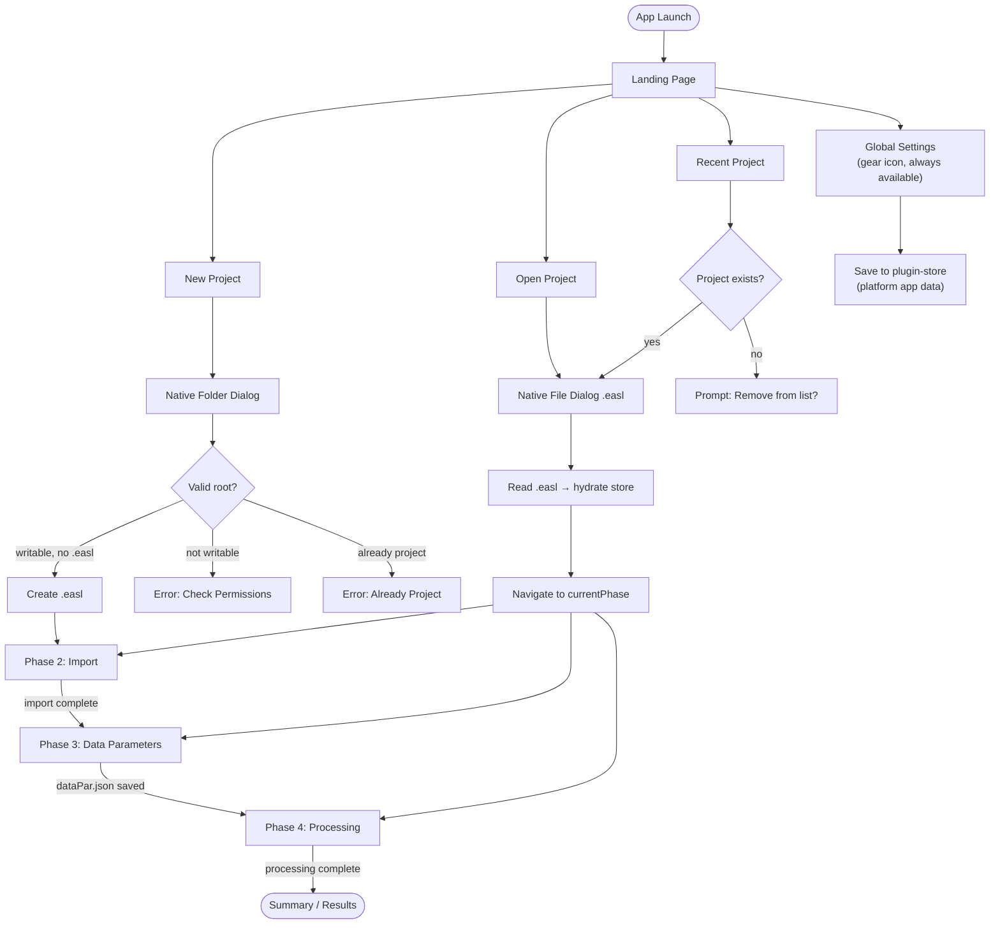
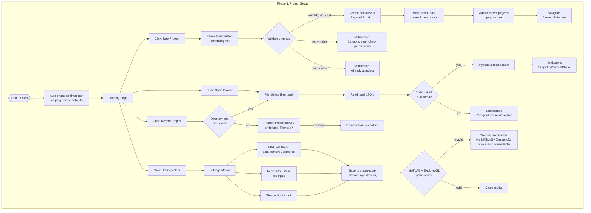
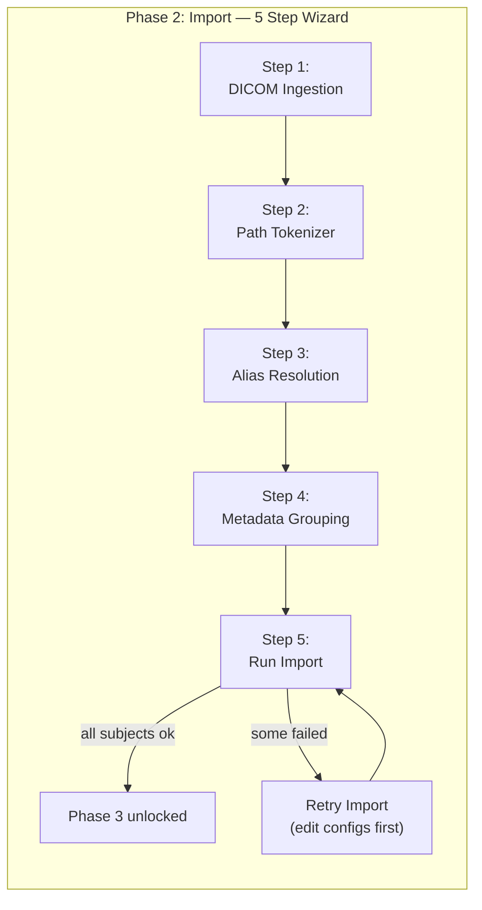
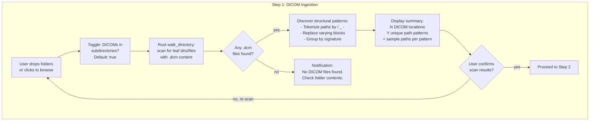
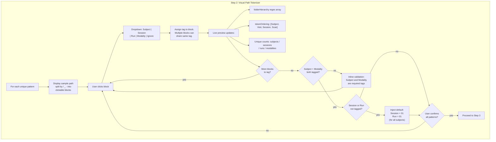
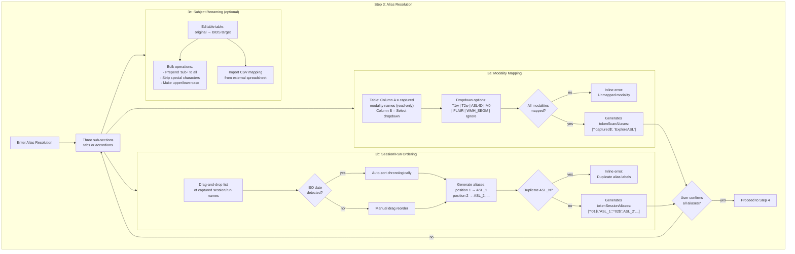
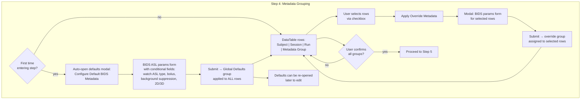

# ExploreASL GUI — User Experience Workflow

Mermaid flowcharts detailing every user action, system response, state change, and error path.

**Conventions:**
- `[Action]` — user action or system operation
- `{Decision?}` — branching condition
- `([Terminal])` — start/end state
- `|label|` — edge trigger text
- `subgraph` — phase/step grouping
- Error paths shown inline as red-branch nodes

---

## 1. High-Level Overview



**Cross-cutting elements present on every route:**
- **Header:** project name, settings gear
- **Sidebar:** Import / Parameters / Processing nav links. Locked phases shown disabled. Current phase highlighted.
- **Status bar:** processing state (idle/running/completed/failed), active project, subject count

---

## 2. Phase 1: Project Setup & Application Shell



**State shape:** `GlobalSettings` (MATLAB installations, ExploreASL path, theme, recent projects) persisted via `@tauri-apps/plugin-store`. `ProjectMeta` (id, name, rootPath, currentPhase) persisted in `.easl`.

---

## 3. Phase 2: Import (DICOM → BIDS) — High Level



Each wizard step stores state in Zustand `importSlice`. The stepper is non-linear: user can go back to prior steps. Back-navigation preserves entered data.

---

### 3a. Step 1: DICOM Ingestion



**Pattern discovery:** Paths like `M01/DICOM/26041205/51410000` and `M02/DICOM/26041206/19120000` share signature `SUBJECT/DICOM/NUMBER/NUMBER` → grouped as one pattern. `Subject1_Visit1/DICOM/series/*dcm` has different signature → separate pattern.

**Rust command:** `walk_directory(root, max_depth, b_match_directories) → { paths, patterns }`

---

### 3b. Step 2: Visual Path Tokenizer



**Tag semantics:**
- **Subject** — required. Identifies a unique participant.
- **Session** — optional. Defaults to `01`. Corresponds to ExploreASL "Visit".
- **Run** — optional. Defaults to `01`. Corresponds to ExploreASL "Session".
- **Modality** — required. Identifies scan type (T1w, ASL4D, etc.).
- **Ignore** — block is non-semantic noise.

**Generated regex:** Tagged blocks become `(.*)` capture groups. Ignored blocks become `.*` (no capture). The staging tree always normalizes to 4-level `Subject/Session/Run/Modality`.

---

### 3c. Step 3: Alias Resolution



---

### 3d. Step 4: Metadata Grouping (studyPar.json)



**studyPar.json generation rules:**
- Each row belongs to exactly one metadata group (Global Defaults or an override).
- First `StudyPars` entry is the catch-all (no `SubjectRegExp`/`SessionRegExp`).
- Subsequent entries are overrides with exact-match regex derived from row selection.

---

### 3e. Step 5: Import Runner

```mermaid
flowchart TD
    subgraph P2E["Step 5: Import Runner"]
        GEN["Frontend generates<br/>sourcestructure.json<br/>+ studyPar.json"] --> ZOD_CHK{"Both configs<br/>valid per Zod?"}
        ZOD_CHK -->|fail| ZOD_ERR["Show validation errors<br/>Cannot proceed"]
        ZOD_CHK -->|pass| STAGE["Rust: create .easl_staging/<br/>sourcedata/ symlink tree<br/>4-level: Subj/Sess/Run/Mod"]

        STAGE --> WRITE_CFG["Rust: write config files<br/>to .easl_staging/"]
        WRITE_CFG --> SPAWN["Spawn MATLAB subprocess:<br/>ExploreASL staging,[1 1 0],0"]

        SPAWN --> STREAM["Stream stdout/stderr<br/>to frontend"]
        STREAM --> PARSE{"Parse each<br/>stdout line"}

        PARSE -->|"completed signal"| OK["Mark subject: completed"]
        PARSE -->|"'DCM2NII failed for'"| FAIL_DCM["Mark subject: DCM2NII failed<br/>Extract error message"]
        PARSE -->|"'NII2BIDS failed for'"| FAIL_NII["Mark subject: NII2BIDS failed<br/>Extract error message"]
        PARSE -->|"process crash"| CRASH["MATLAB crashed<br/>Preserve staging for debug"]
        PARSE -->|"other line"| LOG[Append to log view]

        FAIL_DCM --> CLEAN["Delete 3 status files for<br/>subject: 010, 020, 999<br/>(ExploreASL creates them<br/>even on failure)"]
        FAIL_NII --> CLEAN

        OK --> CHECK_DONE{"All subjects<br/>processed?"}
        CLEAN --> CHECK_DONE
        LOG --> STREAM

        CHECK_DONE -->|no| STREAM
        CHECK_DONE -->|yes| ANY_FAIL{"Any<br/>failures?"}

        ANY_FAIL -->|yes| FAIL_SUMMARY["Summary: X succeeded<br/>Y failed + error details<br/>Show Retry button"]
        ANY_FAIL -->|no| MV["Atomic mv staging → rawdata/<br/>Cleanup .easl_staging/"]
        MV --> OK_SUMMARY["Summary: all succeeded<br/>Phase 3 now unlocked"]

        FAIL_SUMMARY --> RETRY{"User clicks<br/>Retry?"}
        RETRY -->|"yes (may edit configs)"| SPAWN
        RETRY -->|"no, fix later"| STAY[Stay on summary page]

        CRASH --> CRASH_NOTIFY["Notification: MATLAB crashed<br/>Staging preserved at path<br/>for debugging"]
        CRASH_NOTIFY --> STAY
    end
```



**Symlink strategy:**
- Linux/macOS: POSIX symlinks.
- Windows: try symlink → hard link → copy (fallback chain).

**Stdout error parsing:** Import module lock files (`010_DCM2NII.status`, `020_NII2BIDS.status`, `999_ready.status`) are too coarse — created even on failure. Parse stdout for `DCM2NII failed for`, `NII2BIDS failed for`, `ERROR:` patterns instead.

---

## 4. Phase 3: Data Parameters (dataPar.json)

```mermaid
flowchart TD
    subgraph P3["Phase 3: Data Parameters"]
        ENTER["Navigate to<br/>/project/:id/parameters"] --> LOAD{"dataPar.json<br/>exists?"}
        LOAD -->|yes| VALID{"Valid JSON<br/>per Zod?"}
        LOAD -->|no| GET_DEFAULTS[Load ExploreASL defaults]
        VALID -->|yes| MERGE[Load existing values<br/>merge with defaults]
        VALID -->|no| WARN_LOAD["Warning: invalid values.<br/>Defaults loaded instead."]
        WARN_LOAD --> GET_DEFAULTS

        GET_DEFAULTS --> SIDEBAR["Sidebar layout:<br/>Field Strength selector<br/>+ 9 parameter groups"]
        MERGE --> SIDEBAR

        SIDEBAR --> FS[Select Field Strength:<br/>1.5T | 3T | 7T]
        FS --> UPDATE_FS["Update quantification defaults:<br/>T1blood, T2art, Lambda, T1GM, etc."]

        SIDEBAR --> GROUP["Select parameter group:<br/>1. Environment<br/>2. Study<br/>3. M0<br/>4. Quantification<br/>5. ASL Processing<br/>6. Structural<br/>7. General<br/>8. Masking & Atlas"]
        GROUP --> FORM["Show group form:<br/>typed inputs with defaults<br/>help text from ExploreASL docs<br/>DESCRIPTION + DEFAULTS columns"]

        FORM --> MODIFY[User modifies fields]
        MODIFY --> BLUR["Zod validates on blur"]
        BLUR -->|invalid| INLINE_ERR[Inline field errors<br/>red border + message]
        INLINE_ERR --> MODIFY
        BLUR -->|valid| DIRTY[Mark unsaved changes]

        DIRTY --> MORE{"More groups<br/>to configure?"}
        MORE -->|yes| GROUP

        MORE -->|no| PREVIEW_BTN[Preview JSON button]
        PREVIEW_BTN --> PREVIEW_MODAL[Read-only formatted JSON modal]

        MORE -->|no| SAVE_BTN[Save button]
        SAVE_BTN --> HAS_ERR{"Any validation<br/>errors?"}
        HAS_ERR -->|yes| DISABLED["Save disabled<br/>fix errors first"]
        HAS_ERR -->|no| WRITE["Write dataPar.json<br/>to derivatives/ExploreASL/"]
        WRITE -->|success| CLEAR["Clear unsaved flag"]
        WRITE -->|disk error| SAVE_ERR["Notification:<br/>Failed to save.<br/>Check permissions."]

        SIDEBAR --> NAV["Navigate to other phase<br/>via sidebar"]
        NAV --> CHECK_DIRTY{"Unsaved<br/>changes?"}
        CHECK_DIRTY -->|yes| BADGE["Unsaved badge on<br/>sidebar Parameters link"]
    end
```

**Parameter group details:**
| # | Group | Key |
|---|-------|-----|
| 1 | Environment | `bAutomaticallyDetectFSL`, `bAutomaticallyDetectVABY` |
| 2 | Study | `SESSIONS`, pre-populated from Phase 2 aliases |
| 3 | M0 | `M0_conventionalProcessing`, `M0_GMScaleFactor`, position arrays |
| 4 | Quantification | Field-strength-dependent: `Lambda`, `T2art`, `T1blood`, `T1GM`, etc. |
| 5 | ASL Processing | `motionCorrection`, registration, PVC, external quantification (conditional) |
| 6 | Structural | `bRunLongReg`, `bRunDARTEL`, `WMHsegmAlg`, SPM/CAT12 segmentation |
| 7 | General | `Quality`, `DELETETEMP`, skip flags, `stopAfterErrors` |
| 8 | Masking & Atlas | `bMasking`, atlas selection (free / free-for-non-commercial), tissue thresholds |

**Dataset parameters (subject selection) deferred to Phase 4.**

---

## 5. Phase 4: Processing Dashboard

```mermaid
flowchart TD
    subgraph P4["Phase 4: Processing Dashboard"]
        ENTER_P4["Navigate to<br/>/project/:id/processing"] --> SCAN["Rust: scan rawdata/<br/>for subjects and sessions"]
        SCAN --> SELECTION["Subject Selection<br/>Tree/MultiSelect<br/>All selected by default<br/>Session-level granularity"]

        SELECTION --> MATLAB_VERSION["MATLAB version dropdown<br/>from global settings<br/>Required"]
        MATLAB_VERSION --> MODULES["Module checkboxes:<br/>Structural | ASL | Population<br/>Min 1 required"]
        MODULES --> WORKERS["Worker count:<br/>Max = physical cores<br/>Safe = RAM / 4GB<br/>Default = min safe, 4"]
        WORKERS --> PREFLIGHT["Preflight check"]

        PREFLIGHT --> CHK_M{"MATLAB path<br/>valid?"}
        CHK_M -->|no| ERR_M["Error: MATLAB not found<br/>Check Settings"]
        CHK_M -->|yes| CHK_E{"ExploreASL<br/>path valid?"}
        CHK_E -->|no| ERR_E["Error: ExploreASL not found<br/>Check Settings"]
        CHK_E -->|yes| CHK_D{"dataPar.json<br/>exists?"}
        CHK_D -->|no| WARN_D["Warning only:<br/>ExploreASL uses defaults"]
        CHK_D -->|yes| READY["Ready to start"]
        WARN_D --> READY

        READY --> START["Start Processing"]
        START --> MERGE_DP["Rust: merge dataset params<br/>subjectRegexp, exclusion<br/>into dataPar.json"]
        MERGE_DP --> SPAWN_W["Spawn N MATLAB workers<br/>ExploreASL root,0,modules<br/>0,iWorker,nWorkers"]
        SPAWN_W --> WATCH["Start file watcher on<br/>derivatives/ExploreASL/lock/"]
        SPAWN_W --> LOG_STREAM["Stream stdout/stderr<br/>to log output<br/>capped at 500 lines"]

        WATCH --> EVENT["LockFileEvent:<br/>.status file created/deleted"]
        EVENT --> UPDATE_UI["Update grid + progress bar"]

        subgraph DASH["Live Dashboard"]
            GRID["DataTable:<br/>Subject | Session | Module<br/>| Status | Step | Time"]
            PROGRESS["Overall progress bar"]
            CONTROLS["Start | Pause | Kill | Resume"]
            LOG_VIEW["Scrollable log output"]
        end

        UPDATE_UI --> GRID
        UPDATE_UI --> PROGRESS

        GRID --> EXPAND["Expandable row → step timeline:<br/>pending → running → completed<br/>or failed, with timestamps"]

        EXPAND --> RCTX["Right-click completed step"]
        RCTX --> ROLLBACK["Context menu: Rollback to here"]
        ROLLBACK --> ROLLBACK_CONFIRM["Confirm dialog:<br/>Marks step onwards<br/>as incomplete"]
        ROLLBACK_CONFIRM -->|confirm| DEL_STATUS["Rust: delete .status files<br/>for step + all subsequent<br/>+ 999_ready.status"]
        DEL_STATUS --> PENDING["Subject returns pending<br/>for that step"]

        CONTROLS -->|Pause| SIGTERM["Send SIGTERM<br/>to all workers"]
        CONTROLS -->|Kill| SIGKILL["Send SIGKILL<br/>after 5s timeout"]
        CONTROLS -->|Resume| RESUME["Re-invoke MATLAB<br/>for incomplete subjects"]

        SIGTERM --> PAUSED[State: paused]
        SIGKILL --> INTERRUPTED[State: interrupted]

        INTERRUPTED --> BANNER["Warning banner on re-entry:<br/>Processing was interrupted.<br/>Resume or Clean."]

        BANNER --> BTN_RESUME["Resume button"]
        BANNER --> BTN_CLEAN["Clean Interrupted button"]
        BTN_RESUME --> SCAN_LOCK["Rust: scan lock dir<br/>for incomplete subjects"]
        SCAN_LOCK --> DEL_LAST["Delete last attempted<br/>step status file"]
        DEL_LAST --> RESUME
        BTN_CLEAN --> DEL_ALL["Rust: delete all outputs<br/>+ lock files for subject"]

        UPDATE_UI --> ALL_DONE{"All subjects<br/>completed?"}
        ALL_DONE -->|no| WATCH
        ALL_DONE -->|yes| SUMMARY["Summary:<br/>X succeeded, Y failed, Z skipped"]

        SUMMARY --> ANY_FAIL_P4{"Any<br/>failures?"}
        ANY_FAIL_P4 -->|yes| FAIL_DETAIL["Failed subject details:<br/>which step, error from log"]
        SUMMARY --> OPEN_DIR["Open output directory<br/>in file manager<br/>via plugin-opener"]
    end
```



**Known step codes (ASL module):**

| Code | Label |
|------|-------|
| `020_RealignASL` | Realign ASL |
| `030_RegisterASL` | Register ASL |
| `040_ResampleASL` | Resample ASL |
| `050_PreparePV` | Prepare PV |
| `060_ProcessM0` | Process M0 |
| `070_CreateAnalysisMask` | Create analysis mask |
| `080_Quantification` | Quantification |
| `090_VisualQC_ASL` | Visual QC |
| `999_ready` | Module complete |

Similar step structures for Structural and Population modules. **TODO: obtain complete step code listings for all three modules.**

**Background execution:** Processing runs asynchronously. User can navigate away; the global status bar (in `Layout`) shows active processing state across routes. Returning to `/project/:id/processing` restores the live dashboard via `read_lock_status`.

---

## 6. Terminology Mapping

| GUI / BIDS | ExploreASL | `tokenOrdering` index |
|------------|------------|-----------------------|
| Subject | Subject | 1 |
| Session | Visit | 2 |
| Run | Session | 3 |
| — (modality) | — (scan) | 4 |

The GUI uses BIDS terms everywhere. ExploreASL docs and `sourcestructure.json` `tokenOrdering` use the legacy `[Subject, Visit, Session, Scan]` ordering.

---

## 7. Known Gaps & TODOs

| # | Gap | Source Spec |
|---|-----|-------------|
| 1 | Complete listing of import failure patterns from MATLAB stdout | `phase2-import.md` |
| 2 | Complete listing of all status file codes per module (Structural, Population) | `phase4-processing.md` |
| 3 | `dcm2nii_version` override UI (uses default only in V0) | `phase2-import.md` |
| 4 | DICOM header parsing for modality detection (folder-name only in V0) | `master.md` |
| 5 | Partial re-execution of failed import subjects (full re-import only in V0) | `phase2-import.md` |
| 6 | Auto-resume after GUI crash (manual Resume button only in V0) | `phase4-processing.md` |
| 7 | Population module statistical result display (tables/charts) | `phase4-processing.md` |
| 8 | Preset/template support for dataPar.json (defaults only in V0) | `phase3-dataparams.md` |
| 9 | Parameter conflict detection (e.g., PVC without segmentation warning) | `phase3-dataparams.md` |
| 10 | Defacing module (3rd import step `DEFACE` — not exposed in V0) | `phase2-import.md` |
